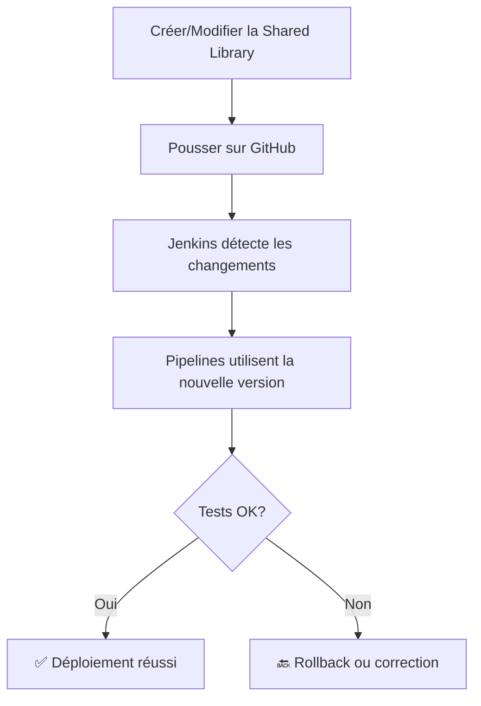

# 📚 Jenkins Shared Library - Bibliothèque de Fonctions Réutilisables

[](https://www.jenkins.io/)
[](https://groovy-lang.org/)

> Projet réalisé dans le cadre du **TD3 - Gestion et Utilisation d'une Shared Library Jenkins**  
> Par **Fieni Dannie Innocent Junior** - MCS 26.2 Cybersécurité & Cloud Computing  
> IPSSI Nice - 2025

---

## 📖 Description

Cette Shared Library Jenkins centralise du code réutilisable pour standardiser et simplifier les pipelines CI/CD. Elle contient des **classes Groovy**, des **fonctions globales** et des **utilitaires Maven** utilisables dans n'importe quel pipeline Jenkins.

---

## 🎯 Objectifs pédagogiques

- ✅ Comprendre le concept de Shared Library Jenkins
- ✅ Structurer une bibliothèque partagée (`src/` et `vars/`)
- ✅ Créer des classes Groovy réutilisables
- ✅ Définir des fonctions globales accessibles partout
- ✅ Configurer une Shared Library dans Jenkins
- ✅ Appliquer le principe DRY (Don't Repeat Yourself)

---

## 🏗️ Structure de la bibliothèque

```
jenkins-shared-library/
├── src/                                    # Classes Groovy
│   └── org/
│       └── exemple/
│           └── utils/
│               └── MonUtilitaire.groovy    # Classe avec méthodes utilitaires
├── vars/                                   # Fonctions globales
│   ├── autreFonction.groovy               # Fonction simple
│   ├── monEtapePersonnalisee.groovy       # Fonction avec closure
│   └── buildMaven.groovy                  # Fonction Maven réutilisable
└── README.md                               # Ce fichier
```

---

## 🔧 Prérequis

- **Jenkins** (version LTS recommandée)
- **Plugin "Pipeline: Shared Groovy Libraries"** (installé par défaut)
- **Git** et accès à GitHub
- Connaissances de base en **Groovy**

---

## 📦 Installation et configuration

### 1️⃣ Cloner le repository

```bash
git clone https://github.com/JuFiSec/jenkins-shared-library.git
cd jenkins-shared-library
```

### 2️⃣ Configurer dans Jenkins

#### Via l'interface Jenkins (recommandé)

1. **Accéder à la configuration**
   - Manage Jenkins → System
   - Section "Global Pipeline Libraries"

2. **Ajouter la bibliothèque**
   - Cliquer sur **Add**
   - **Name** : `ma-lib-partagee`
   - **Default version** : `main`
   - ✅ **Load implicitly** (charger automatiquement)
   - ✅ **Allow default version to be overridden**

3. **Configuration du repository**
   - **Retrieval method** : Modern SCM
   - **Source Code Management** : Git
   - **Project Repository** : `https://github.com/JuFiSec/jenkins-shared-library.git`

4. **Sauvegarder**

---

## 📚 Contenu de la bibliothèque

### 1. Classe `MonUtilitaire` (src/)

📁 **Fichier** : `src/org/exemple/utils/MonUtilitaire.groovy`

```groovy
package org.exemple.utils

class MonUtilitaire implements Serializable {
    
    def script
    
    MonUtilitaire(script) {
        this.script = script
    }
    
    def saluer(nom) {
        script.echo "Bonjour de la Shared Library, ${nom} !"
    }
    
    def faireQuelqueChose() {
        script.echo "Opération réussie !"
        return true
    }
}
```

**📝 Usage** :
```groovy
import org.exemple.utils.MonUtilitaire

def utils = new MonUtilitaire(this)
utils.saluer("Jenkins User")
def resultat = utils.faireQuelqueChose()
```

**🎯 Cas d'usage** :
- Fonctions complexes nécessitant une logique orientée objet
- Réutilisation de code métier entre plusieurs pipelines
- Gestion d'état et de configuration

---

### 2. Fonction `autreFonction` (vars/)

📁 **Fichier** : `vars/autreFonction.groovy`

```groovy
def call(String message) {
    echo "Message depuis autreFonction : ${message}"
    return true
}
```

**📝 Usage** :
```groovy
def resultat = autreFonction("Mon message")
echo "Résultat: ${resultat}"
```

**🎯 Cas d'usage** :
- Fonctions utilitaires simples
- Affichage de messages standardisés
- Validation de paramètres

---

### 3. Fonction `monEtapePersonnalisee` (vars/)

📁 **Fichier** : `vars/monEtapePersonnalisee.groovy`

```groovy
def call(Closure body) {
    echo "Début de l'étape personnalisée"
    body()
    echo "Fin de l'étape personnalisée"
}
```

**📝 Usage** :
```groovy
monEtapePersonnalisee {
    echo "Code à exécuter dans l'étape"
    // ... autres actions
}
```

**🎯 Cas d'usage** :
- Wrapper pour standardiser des patterns
- Try-catch globaux
- Gestion de contexte (début/fin d'étape)
- Logging uniforme

---

### 4. Fonction `buildMaven` (vars/)

📁 **Fichier** : `vars/buildMaven.groovy`

```groovy
def call(Map config = [:]) {
    def mavenVersion = config.mavenVersion ?: 'Maven 3.9'
    def goals = config.goals ?: 'clean test'
    
    echo "Compilation et tests avec Maven (${goals})..."
    sh "mvn ${goals}"
}
```

**📝 Usage** :
```groovy
// Avec paramètres par défaut
buildMaven()

// Avec paramètres personnalisés
buildMaven(goals: 'clean install')
buildMaven(goals: 'clean compile', mavenVersion: 'Maven 3.9')
```

**🎯 Cas d'usage** :
- Standardiser les builds Maven
- Centraliser la configuration Maven
- Simplifier les Jenkinsfiles

---

## 🚀 Utilisation dans un pipeline

### Méthode 1 : Chargement implicite (recommandé)

Si "Load implicitly" est coché dans la configuration Jenkins :

```groovy
@Library('ma-lib-partagee') _

import org.exemple.utils.MonUtilitaire

pipeline {
    agent any
    
    stages {
        stage('Test') {
            steps {
                script {
                    def utils = new MonUtilitaire(this)
                    utils.saluer("Mon Projet")
                    
                    autreFonction("Test de la bibliothèque")
                    
                    monEtapePersonnalisee {
                        echo "Code dans le bloc"
                    }
                }
            }
        }
    }
}
```

### Méthode 2 : Spécifier une version

```groovy
@Library('ma-lib-partagee@main') _
// ou
@Library('ma-lib-partagee@v1.0') _
```

### Méthode 3 : Chargement multiple

```groovy
@Library(['ma-lib-partagee', 'autre-lib']) _
```

---

## 🔍 Comparaison src/ vs vars/

| Aspect | `src/` (Classes) | `vars/` (Fonctions globales) |
|--------|------------------|------------------------------|
| **Structure** | Package + Classe Groovy | Fichier unique |
| **Import** | Requis (`import ...`) | Automatique |
| **Instanciation** | `new MaClasse(this)` | Appel direct |
| **Complexité** | Logique complexe, OOP | Fonctions simples |
| **État** | Peut maintenir un état | Sans état (stateless) |
| **Usage** | Code métier structuré | Utilitaires rapides |

---

## 📊 Avantages de la Shared Library

### ✅ Réutilisabilité
- Code partagé entre tous les pipelines
- Évite la duplication (principe DRY)

### ✅ Maintenabilité
- Modification centralisée
- Mise à jour automatique pour tous les pipelines

### ✅ Standardisation
- Patterns communs uniformisés
- Best practices appliquées partout

### ✅ Testabilité
- Code testé séparément
- Qualité garantie

### ✅ Versioning
- Gestion de versions avec Git tags
- Rollback facile si nécessaire

---

## 🔄 Workflow de développement



---

## 🏷️ Gestion des versions

### Créer une version stable

```bash
git tag v1.0
git push origin v1.0
```

### Utiliser une version spécifique dans un pipeline

```groovy
@Library('ma-lib-partagee@v1.0') _
```

### Stratégie de versioning recommandée

- `main` : Version de développement (latest)
- `v1.0`, `v1.1` : Versions stables taguées
- `feature/*` : Branches de développement

---

## 🛠️ Bonnes pratiques

### ✅ À faire
- ✅ Documenter chaque fonction
- ✅ Utiliser des noms explicites
- ✅ Gérer les erreurs proprement
- ✅ Tester les modifications
- ✅ Versionner avec des tags
- ✅ Suivre une convention de nommage

### ❌ À éviter
- ❌ Code spécifique à un projet
- ❌ Hardcoder des valeurs
- ❌ Fonctions trop complexes dans vars/
- ❌ Modifications non testées
- ❌ Casser la compatibilité sans version

---

## 🧪 Tests et validation

### Tester localement

```bash
# Vérifier la syntaxe Groovy
groovy -c src/org/exemple/utils/MonUtilitaire.groovy
groovy -c vars/autreFonction.groovy
```

### Tester dans Jenkins

1. Créer un pipeline de test
2. Utiliser la bibliothèque
3. Vérifier les logs

```groovy
@Library('ma-lib-partagee') _
import org.exemple.utils.MonUtilitaire

pipeline {
    agent any
    stages {
        stage('Test Library') {
            steps {
                script {
                    def utils = new MonUtilitaire(this)
                    utils.saluer("Test")
                    assert utils.faireQuelqueChose() == true
                }
            }
        }
    }
}
```

---

## 📈 Évolutions futures

- [ ] Ajouter des fonctions pour Docker
- [ ] Intégrer des notifications (Slack, Teams)
- [ ] Créer des wrappers pour Kubernetes
- [ ] Ajouter des fonctions de sécurité (scan, audit)
- [ ] Implémenter des métriques et monitoring
- [ ] Créer une documentation auto-générée

---

## 🔗 Ressources

- [Documentation Jenkins Shared Libraries](https://www.jenkins.io/doc/book/pipeline/shared-libraries/)
- [Groovy Language Documentation](https://groovy-lang.org/documentation.html)
- [Pipeline Syntax Reference](https://www.jenkins.io/doc/book/pipeline/syntax/)

---

## 📝 Licence

Ce projet est réalisé à des fins pédagogiques dans le cadre de la formation MCS 26.2 à IPSSI Nice.

---

## 👤 Auteur

**Fieni Dannie Innocent Junior**  
MCS 26.2 - Cybersécurité & Cloud Computing  
IPSSI Nice - 2025

[](https://github.com/JuFiSec)

---

## 🙏 Remerciements

- IPSSI Nice pour la formation
- La communauté Jenkins
- Les contributeurs open source

---

**Date de création** : Octobre 2025  
**Dernière mise à jour** : Octobre 2025